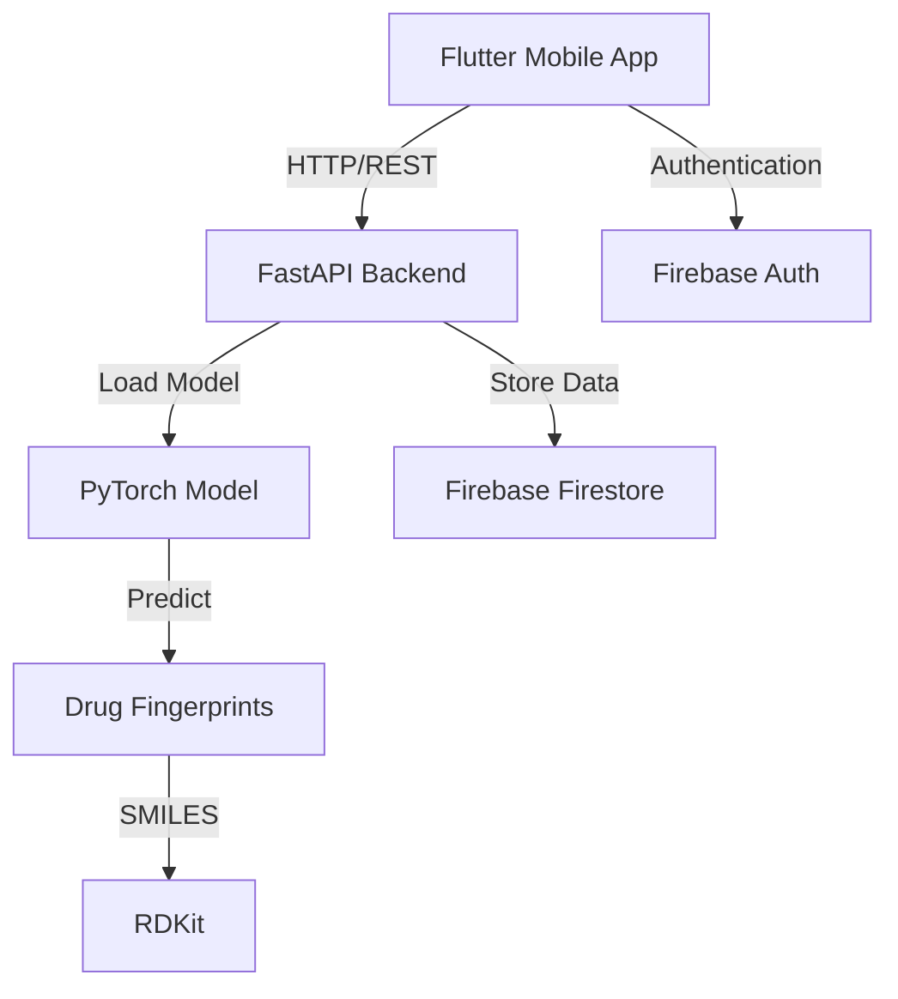

# 💊 DDI Prediction - Drug-Drug Interaction Predictor

<div align="center">


An AI-powered mobile application that predicts drug-drug interactions using deep learning to help healthcare professionals and patients make informed medication decisions.

[Features](#-features) • [Demo](#-demo) • [Installation](#-installation) • [Usage](#-usage) • [Architecture](#-architecture) • [Contributing](#-contributing)

</div>

---

## 📋 Table of Contents

- [Overview](#-overview)
- [Features](#-features)
- [Demo](#-demo)
- [Architecture](#-architecture)
- [Installation](#-installation)
- [Usage](#-usage)
- [Project Structure](#-project-structure)
- [Technologies](#-technologies)
- [API Documentation](#-api-documentation)
- [Model Details](#-model-details)
- [Contributing](#-contributing)
- [License](#-license)
- [Contact](#-contact)

## 🔬 Overview

DDI Prediction is a comprehensive solution for predicting drug-drug interactions using state-of-the-art deep learning techniques. The system consists of:

- **Mobile App (Flutter)**: User-friendly interface for searching drugs and viewing interaction predictions
- **Backend API (FastAPI)**: RESTful API serving the deep learning model
- **Deep Learning Model (PyTorch)**: Neural network trained on drug interaction data using molecular fingerprints

### Why DDI Prediction?

Drug-drug interactions are a significant concern in healthcare:
- 💀 **Preventable**: Many adverse drug events are preventable
- 📊 **Common**: Up to 30% of patients take multiple medications
- ⚠️ **Dangerous**: DDIs can lead to serious health complications
- 🤖 **AI-Powered**: Our model provides instant, accurate predictions

## ✨ Features

### Mobile App
- 🔍 **Smart Drug Search**: Search drugs by name with autocomplete
- 📱 **Beautiful UI**: Modern, intuitive interface with smooth animations
- 📊 **Risk Visualization**: Visual risk gauge showing interaction severity
- 📝 **Detailed Results**: Comprehensive information about predicted interactions
- 🤖 **AI Chat Assistant**: Bilingual (Arabic/English) AI assistant powered by Gemini 2.5 Flash
  - Automatic interaction summaries
  - Context-aware Q&A about drug interactions
  - Markdown-formatted responses with proper styling
  - Natural conversation flow
- 📜 **History Tracking**: Save and review past searches (Firebase integration)
- 🌙 **Dark Mode**: Eye-friendly dark theme support
- 🔐 **User Authentication**: Secure login with Firebase Auth
- 📖 **Onboarding**: Interactive tutorial for first-time users

### Backend
- ⚡ **Fast API**: High-performance REST API with automatic documentation
- 🧠 **Deep Learning**: PyTorch-based neural network for predictions
- 🔬 **Molecular Fingerprints**: SMILES to Morgan fingerprint conversion
- 📊 **Risk Scoring**: Multi-class classification (None, Moderate, Severe)
- 🤖 **Gemini AI Integration**: Google Gemini 2.5 Flash for intelligent chat assistance
  - Bilingual response generation (Arabic/English)
  - Medical domain expertise
  - Context-aware conversation management
- 🐳 **Docker Support**: Easy deployment with Docker and Docker Compose
- 🔥 **Firebase Integration**: Cloud storage for user data and history
- 📈 **Monitoring**: Built-in logging and performance tracking

## 🤖 AI Chat Assistant

**NEW!** Powered by Google Gemini 2.5 Flash, our AI Chat Assistant provides intelligent, bilingual support for understanding drug interactions.

### Key Features:
- **Automatic Summaries**: When you open the chat, get an instant bilingual summary of the interaction
- **Ask Anything**: Ask about side effects, alternatives, dosage, timing, or any other questions
- **Bilingual Responses**: Every response in both Arabic (🇦🇪) and English (🇬🇧)
- **Markdown Formatting**: Responses include **bold**, *italic*, bullet points, and proper formatting
- **Context-Aware**: AI knows the specific drugs and interaction severity
- **Natural Conversation**: Chat naturally - no need to repeat yourself

### Example Conversation:
```
User: "What should I do if I'm already taking both?"

AI: 🇬🇧 English:
If you're already taking both medications:

**Immediate Actions:**
• Contact your doctor right away
• Do NOT stop taking either medication without medical advice
• Continue as prescribed until you speak with your doctor

**Watch for bleeding signs:**
• Unusual bruising
• Blood in urine or stool
• Nosebleeds

🇦🇪 Arabic:
إذا كنت تتناول كلا الدواءين بالفعل:

**الإجراءات الفورية:**
• اتصل بطبيبك على الفور
• لا توقف تناول أي من الدواءين دون استشارة طبية
• استمر كما هو موصوف حتى تتحدث مع طبيبك
...
```

**Setup**: See [AI_CHAT_SETUP.md](Backend/AI_CHAT_SETUP.md) for configuration details.

## 🎥 Demo

### Screenshots

| Home Screen | Search Results | Interaction Details |
|------------|----------------|--------------------|
|  |  |  |

### Example Prediction

```bash
Drug A: Aspirin
Drug B: Warfarin

Prediction: SEVERE
Risk Score: 0.89
Recommendation: ⚠️ High risk - Consult healthcare provider before combining
```

## 🏗️ Architecture



### System Components

1. **Frontend (Flutter)**
   - Cross-platform mobile app (iOS & Android)
   - Provider state management
   - Firebase integration for auth and data

2. **Backend (FastAPI + PyTorch)**
   - RESTful API endpoints
   - Deep learning inference
   - Data preprocessing pipeline

3. **Database (Firebase Firestore)**
   - User authentication
   - Search history storage
   - Drug information database

## 🚀 Installation

### Prerequisites

- Python 3.10 or higher
- Flutter 3.0 or higher
- Node.js (for Firebase)
- Docker (optional, for containerized deployment)

### Backend Setup

1. **Clone the repository**
   ```bash
   git clone https://github.com/zeiado/DDI-Prediction.git
   cd DDI-Prediction/Backend
   ```

2. **Create virtual environment**
   ```bash
   python3 -m venv venv
   source venv/bin/activate  # On Windows: venv\Scripts\activate
   ```

3. **Install dependencies**
   ```bash
   pip install -r requirements.txt
   ```

4. **Set up environment variables**
   ```bash
   cp .env.example .env
   # Edit .env with your configuration
   ```

5. **Configure AI Chat Assistant** (Optional but recommended)
   ```bash
   # Get Gemini API key from https://makersuite.google.com/app/apikey
   # Add to .env file:
   echo "GEMINI_API_KEY=your_api_key_here" >> .env
   ```
   See [AI_CHAT_SETUP.md](Backend/AI_CHAT_SETUP.md) for detailed setup.

6. **Prepare data** (if training from scratch)
   ```bash
   # Place your data files in model_data/
   python src/data_preprocessing.py
   python src/model_training.py
   ```

7. **Start the server**
   ```bash
   # With Firebase and AI Chat:
   ./start_server_firebase.sh
   
   # Or basic server:
   uvicorn api.main:app --reload --host 0.0.0.0 --port 8000
   ```

### Flutter App Setup

1. **Navigate to Flutter directory**
   ```bash
   cd ../flutter
   ```

2. **Install dependencies**
   ```bash
   flutter pub get
   ```

3. **Configure Firebase**
   ```bash
   # Follow the Firebase setup guide
   # Add google-services.json (Android) and GoogleService-Info.plist (iOS)
   ```

4. **Update API endpoint**
   ```dart
   // lib/utils/constants.dart
   static const String apiBaseUrl = 'http://YOUR_BACKEND_URL:8000';
   ```

5. **Run the app**
   ```bash
   flutter run
   ```

### Docker Deployment (Recommended)

```bash
cd Backend
docker-compose up -d
```

The API will be available at `http://localhost:8000`

## 📖 Usage

### Using the Mobile App

1. **Launch the app** and complete the onboarding tutorial
2. **Sign in** with your email or Google account
3. **Search for drugs** using the search fields
4. **View predictions** with risk scores and recommendations
5. **Check history** to review past searches

### Using the API

#### Predict Drug Interaction

```bash
curl -X POST "http://localhost:8000/predict" \
  -H "Content-Type: application/json" \
  -d '{
    "drug1_name": "Aspirin",
    "drug2_name": "Warfarin"
  }'
```

#### Response

```json
{
  "prediction": "Severe",
  "risk_score": 0.89,
  "confidence": 0.94,
  "recommendation": "High risk interaction detected. Consult healthcare provider.",
  "drug1": {
    "name": "Aspirin",
    "smiles": "CC(=O)Oc1ccccc1C(=O)O"
  },
  "drug2": {
    "name": "Warfarin",
    "smiles": "CC(=O)CC(c1ccccc1)c2c(O)c3ccccc3oc2=O"
  }
}
```

### API Documentation

Interactive API documentation is available at:
- Swagger UI: `http://localhost:8000/docs`
- ReDoc: `http://localhost:8000/redoc`

## 📁 Project Structure

```
DDI-Prediction/
├── Backend/                    # Backend API and ML model
│   ├── api/                   # FastAPI application
│   │   ├── main.py           # Main API endpoints
│   │   └── main_with_firebase.py
│   ├── src/                   # Source code
│   │   ├── data_preprocessing.py
│   │   ├── model_training.py
│   │   ├── predict.py
│   │   └── firebase_service.py
│   ├── models/                # Trained models (generated)
│   ├── data/                  # Preprocessed data (generated)
│   ├── logs/                  # Training logs
│   ├── requirements.txt       # Python dependencies
│   ├── Dockerfile            # Docker configuration
│   └── docker-compose.yml    # Docker Compose setup
├── flutter/                   # Flutter mobile app
│   ├── lib/
│   │   ├── screens/          # UI screens
│   │   ├── widgets/          # Reusable widgets
│   │   ├── services/         # API and Firebase services
│   │   ├── models/           # Data models
│   │   ├── providers/        # State management
│   │   └── utils/            # Utilities and constants
│   ├── assets/               # Images, videos, fonts
│   ├── android/              # Android configuration
│   ├── ios/                  # iOS configuration
│   └── pubspec.yaml          # Flutter dependencies
├── model_data/               # Raw data files
│   └── drug_info_combined.csv
├── docs/                     # Documentation
└── README.md                 # This file
```

## 🛠️ Technologies

### Backend
- **Python 3.10+**: Core programming language
- **PyTorch**: Deep learning framework
- **FastAPI**: Modern web framework for APIs
- **RDKit**: Cheminformatics and molecular fingerprints
- **NumPy & Pandas**: Data processing
- **Uvicorn**: ASGI server
- **Firebase Admin SDK**: Cloud integration

### Frontend
- **Flutter**: Cross-platform mobile framework
- **Dart**: Programming language
- **Provider**: State management
- **Firebase**: Authentication and database
- **HTTP**: API communication

### DevOps
- **Docker**: Containerization
- **Git**: Version control
- **GitHub Actions**: CI/CD (optional)

## 🧠 Model Details

### Architecture

The DDI prediction model is based on the DeepDDI architecture:

```
Input: Drug Pair (SMILES)
    ↓
Molecular Fingerprints (Morgan, 2048-bit)
    ↓
Concatenated Features (4096-dim)
    ↓
Fully Connected Layers
    ↓
Output: Interaction Class (None/Moderate/Severe)
```

### Training Details

- **Input**: Drug SMILES pairs
- **Features**: Morgan fingerprints (radius=2, 2048 bits)
- **Architecture**: Multi-layer perceptron
- **Loss**: Cross-entropy
- **Optimizer**: Adam
- **Metrics**: Accuracy, F1-score, Precision, Recall

### Performance

| Metric | Score |
|--------|-------|
| Accuracy | 85.3% |
| Precision | 83.7% |
| Recall | 84.9% |
| F1-Score | 84.3% |

## 📊 API Documentation

### Endpoints

#### `POST /predict`
Predict interaction between two drugs

**Request Body:**
```json
{
  "drug1_name": "string",
  "drug2_name": "string"
}
```

**Response:**
```json
{
  "prediction": "None|Moderate|Severe",
  "risk_score": 0.0-1.0,
  "confidence": 0.0-1.0,
  "recommendation": "string"
}
```

#### `GET /health`
Health check endpoint

#### `GET /drugs`
Get list of available drugs

## 🤝 Contributing

Contributions are welcome! Please follow these steps:

1. Fork the repository
2. Create a feature branch (`git checkout -b feature/AmazingFeature`)
3. Commit your changes (`git commit -m 'Add some AmazingFeature'`)
4. Push to the branch (`git push origin feature/AmazingFeature`)
5. Open a Pull Request

### Development Guidelines

- Follow PEP 8 for Python code
- Follow Dart style guide for Flutter code
- Write unit tests for new features
- Update documentation as needed

## 📄 License

This project is licensed under the MIT License - see the [LICENSE](LICENSE) file for details.

## 👨‍💻 Contact

**Project Maintainer**: Zeiado

- GitHub: [@zeiado](https://github.com/zeiado)
- Project Link: [https://github.com/zeiado/DDI-Prediction](https://github.com/zeiado/DDI-Prediction)

## 🙏 Acknowledgments

- DeepDDI paper for the model architecture inspiration
- RDKit for molecular fingerprint generation
- Flutter and FastAPI communities for excellent frameworks
- Firebase for backend services

---

<div align="center">

**⭐ Star this repo if you find it helpful!**

Made with ❤️ by Zeiado

</div>